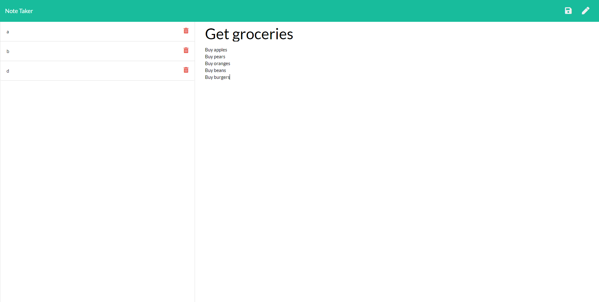

### **Note Taker**
---

#### **Table of Contents**
---
1. [Installation](#installation)
1. [Trials](#trials)
1. [Usage](#usage)
1. [Credits](#credits)
1. [License](#license)

#### **Installation**
---
To make this project you need to do the following:

1. Pull the project down with git clone or fork the repository.
1. Install the dependencies with npm install.
1. Type node backend.js into your node window.
1. Visit localhost:3000 in your web browser to start the app.

You may also visit [my deployed site](https://stark-temple-19524.herokuapp.com/notes).

#### **Trials**
---
Learning how to tell express where the static files are, was a very powerful addition.

#### **Usage**
---
When the site is open, you will see a left menu bar with all the notes stored.  In the middle you will see a place to put a title and a note to be stored.  By clicking the disk icon in the top right you can save the note.  The title of the note will appear on the left hand side of the app to be retrieved later.

#### **Credits**
---
Thanks to Bradley and Pete for help with debugging.

#### **License**
---

Copyright (c) 2005-2020 David Heinemeier Hansson

Permission is hereby granted, free of charge, to any person obtaining
a copy of this software and associated documentation files (the
"Software"), to deal in the Software without restriction, including
without limitation the rights to use, copy, modify, merge, publish,
distribute, sublicense, and/or sell copies of the Software, and to
permit persons to whom the Software is furnished to do so, subject to
the following conditions:

The above copyright notice and this permission notice shall be
included in all copies or substantial portions of the Software.

THE SOFTWARE IS PROVIDED "AS IS", WITHOUT WARRANTY OF ANY KIND,
EXPRESS OR IMPLIED, INCLUDING BUT NOT LIMITED TO THE WARRANTIES OF
MERCHANTABILITY, FITNESS FOR A PARTICULAR PURPOSE AND
NONINFRINGEMENT. IN NO EVENT SHALL THE AUTHORS OR COPYRIGHT HOLDERS BE
LIABLE FOR ANY CLAIM, DAMAGES OR OTHER LIABILITY, WHETHER IN AN ACTION
OF CONTRACT, TORT OR OTHERWISE, ARISING FROM, OUT OF OR IN CONNECTION
WITH THE SOFTWARE OR THE USE OR OTHER DEALINGS IN THE SOFTWARE.

